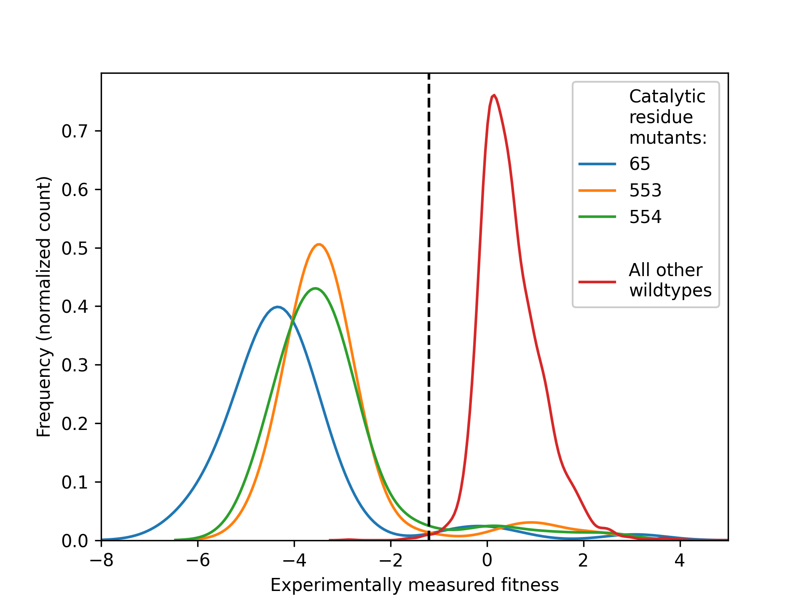

Getting Started
===============

Rationale & Theory
---------------

This software package is a spin-out product from the computational chemistry core of `the ASAP Discovery Consortium
<https://asapdiscovery.org/>`_. Antiviral drug discovery (or any other therapeutic area where mutagenesis of targets is critical to success of drugs) depends heavily on exhaustive exploration of mutational space of therapeutic targets and there is a need to translate these large bodies of data into forms that can be used to instruct decision-making downstream in the drug discovery process.
``choppa`` was built because in the `ASAP Discovery Consortium` there was a need to marry Deep Mutational Scanning (DMS) data (or phylogenetic analyses) with structural biology data. Although simply plotting whatever average (or min/max) fitness value each residue in the DMS data has produces an attractive figure, these types of visualizations are not helpful to medicinal chemists downstream during decision-making moments as they obfuscate a lot of critical information. Instead, there is a need to know `how many` mutations can realistically occur at a given residue, given the `population of fitness values` associated with its measured mutants. 

To count the number of mutations that will realistically occur for a given residue we will need to define a ``fitness threshold``. This is a value highly dependent on the DMS (or phylogenetics) experiment that acts as the threshold above which a mutation is considered `fit`. This value may be decided by experimentalists or by analyzing whether there is a clear gap between fitness values between wildtype sequences and mutants in catalytic residues, for example:

Here, we show the density distributions of the population of fitness values for all mutants of three catalytic residues of a target (blue, green and orange on left-hand side). All samples of the experiment where the sequence was fully wildtype (red, right-hand side) shows `much` higher fitness values, with a clear divide in between the two sets of distributions. The center of this fitness value is an ideal candidate for a fitness threshold.

``choppa`` will require the fitness data (with fitness threshold) and crystal structure to map it on as inputs to its CLI. With a single CLI ``render`` command, ``choppa`` will go through its workflow and generate the outputs:

.. image:: choppa_workflow.png
  :width: 600
  :alt: General workflow of the choppa CLI pipeline

.. note::

   This project is under active development.

Installation
---------------

Clone the ``choppa`` github repository:

.. code-block:: bash

   git clone https://github.com/asapdiscovery/choppa.git

Install the dependencies into a ``conda`` environment with:

.. code-block:: bash

   conda env create --file=choppa.yaml

(for installing ``conda``, see e.g. `micromamba <https://mamba.readthedocs.io/en/latest/installation/micromamba-installation.html>`_)

Activate your new environment:

.. code-block:: bash
    
    conda activate choppa

Install the ``choppa`` package with ``pip`` in the top folder of the code:

.. code-block:: bash

   pip install -e .

Check that you can run ``choppa`` by running:

.. code-block:: bash

   choppa --help

Tutorial
---------------

Although ``choppa`` has a complete python API for you to work with, the easiest way to generate fitness views with ``choppa`` is using its command-line interface (CLI). In your terminal, let's pull up the main help information:

.. code-block:: bash

   choppa --help

which should return the following:

.. code-block:: bash
   
   Usage: choppa [OPTIONS] COMMAND [ARGS]...

   Integrated mutational and structural biology data into a concerted HTML view.

   Options:
   --version  Show the version and exit.
   --help     Show this message and exit.

   Commands:
   render  Create fitness view as a publication-ready PyMOL session file and a read-for-sharing interactive HTML file.

Now let's run the main command in ``choppa`` to get its help information:

.. code-block:: bash

   choppa render --help

which should return the following:

.. code-block:: bash
   
   Usage: choppa render [OPTIONS]

   Create fitness view as a publication-ready PyMOL session file and a read-for-sharing interactive HTML file.

   Options:
      -p, --pdb-file FILE             Path to a PDB file to create fitness view for.  [required]
      -f, --fitness-file FILE         Path to a CSV file with fitness data to create fitness view for.  [required]
      -ft, --fitness-threshold FLOAT  Fitness threshold to determine whether a mutant is fit or not.  [required]
      -op, --outfile-publication FILE
                                  Name of output file to write publication-ready PyMOL session file to. Should end in '.pse'; defaults to 'out.pse'.
      -oi, --outfile-interactive FILE
                                  Name of output file to write ready-to-share interactive HTML file to. Should end in '.html'; defaults to 'out.html'.
      -fc, --fitness-column TEXT      Name of the column in the fitness-file (-f/--fitness-file) that contains fitness values (e.g. LogEffect). If not defined, will
                                  default to 'fitness'.
      -ri, --residue-index-column TEXT
                                  Name of the column in the fitness-file (-f/--fitness-file) that contains residue indices (e.g. 1, 2, .. n). If not defined, will
                                  default to 'residue_index'.
      -wt, --wildtype-column TEXT     Name of the column in the fitness-file (-f/--fitness-file) that contains wildtype residues (e.g. L, G, N). If not defined, will
                                  default to 'wildtype'.
      -mu, --mutant-column TEXT       Name of the column in the fitness-file (-f/--fitness-file) that contains mutant residues (e.g. L, G, N). If not defined, will
                                  default to 'mutant'.
      -c, --confidence-column TEXT    Name of the column in the fitness-file (-f/--fitness-file) that contains confidence values (e.g. counts). If not defined then
                                  LogoPlots in the HTML view will not display confidences.
      --help                          Show this message and exit.

There are a lot of arguments, but only the first three (``--pdb-file``, ``--fitness-file`` and ``fitness-threshold``) are required. The remaining arguments can be used for telling ``choppa`` which column names it should use in your fitness ``CSV`` file. If your column names are the same as the argument defaults (see ``--help`` message) you do not need to use these arguments as ``choppa`` will automatically use the correct columns.
Let's use some of the example files in the choppa repository to try out the CLI workflow. These can be found in ``choppa/data/toy_data``. We'll use `the SARS-CoV-2 Mac1 protein PDB
<https://github.com/asapdiscovery/choppa/blob/main/choppa/data/toy_data/toy_complex_SARS-CoV-2-Mac1.pdb>`_
and `some fictitious fitness data
<https://github.com/asapdiscovery/choppa/blob/main/choppa/data/toy_data/toy_fitness_data_01_complete.csv>`_. 
We'll set the fitness threshold to 0.5. To determine the fitness threshold for your fitness data, see the `Determining a fitness threshold` page of this documentation.

The CLI will cycle through all steps in the ``choppa`` API to generate your views:

.. code-block:: bash

   $ choppa render -p ~/projects/choppa/choppa/data/toy_data/toy_complex_SARS-CoV-2-Mac1.pdb -f ~/projects/choppa/choppa/data/toy_data/toy_fitness_data_01_complete.csv -ft 0.5

Which will print to your terminal something like this:

.. code-block:: bash

   INFO:root:Reading in fitness data from [..]/toy_fitness_data_01_complete.csv
   INFO:root:Successfully read fitness data:
         residue_index wildtype mutant  fitness  confidence
   0                 1        S      S     1.00         NaN
   1                 1        S      V    -0.32         NaN
   2                 1        S      I    -1.79         NaN
   3                 1        S      L    -2.10         NaN
   4                 1        S      E    -1.41         NaN
   ...             ...      ...    ...      ...         ...
   3439            164        F      A    -4.36         NaN
   3440            164        F      G    -4.82         NaN
   3441            164        F      P    -1.13         NaN
   3442            164        F      C    -1.16         NaN
   3443            164        F      X     0.43         NaN

   [3444 rows x 5 columns]
   INFO:root:Created fitness dictionary as `FitnessFactory` of length 164
   /Users/jenkescheen/micromamba/envs/choppa/lib/python3.12/site-packages/Bio/PDB/PDBParser.py:388: PDBConstructionWarning: Ignoring unrecognized record 'TER' at line 2532
     warnings.warn(
   INFO:root:Aligning fitness sequence to complex..

   INFO:root:Found alignment:
   CSV               0 SFSGYLKLTDNVYIKNADIVEEAKKVKPTVVVNAANVYLKHGGGVAGALNKATNNAMQVE
                     0 ||||||||||||||||||||||||||||||||||||||||||||||||||||||||||||
   PDB               0 SFSGYLKLTDNVYIKNADIVEEAKKVKPTVVVNAANVYLKHGGGVAGALNKATNNAMQVE

   CSV              60 SDDYIATNGPLKVGGSCVLSGHNLAKHCLHVVGPNVNKGEDIQLLKSAYENFNQHEVLLA
                    60 ||||||||||||||||||||||||||||||||||||||||||||||||||||||||||||
   PDB              60 SDDYIATNGPLKVGGSCVLSGHNLAKHCLHVVGPNVNKGEDIQLLKSAYENFNQHEVLLA

   CSV             120 PLLSAGIFGADPIHSLRVCVDTVRTNVYLAVFDKNLYDKLVSSF- 164
                   120 ||||||||||||||||||||||||||||||||||||||||||||- 165
   PDB             120 PLLSAGIFGADPIHSLRVCVDTVRTNVYLAVFDKNLYDKLVSSFX 165

   INFO:root:After aligning fitness data to PDB complex, filled 0 empty entries in the fitness sequence (total entries in sequence: 165).

   INFO:root:Starting PyMOL session
   INFO:root:PyMOL session: setting up system
   INFO:root:PyMOL session: coloring system surface with fitness data..
   INFO:root:PyMOL session: fitness degree per residue found using threshold 0.5:
   {'n_fit_0': '', 'n_fit_1': '', 'n_fit_2': '17+86+149+165', 'n_fit_3': '5+30+36+53+82+100+109+124+127+150', 'n_fit_4': '28+31+44+49+50+98+122+128+129+131+137+140+152+164', 'n_fit_5': '6+7+8+9+10+11+12+13+14+15+16+18+19+20+21+22+23+24+25+26+27+29+32+33+34+35+37+38+39+40+41+42+43+45+46+47+48+51+52+54+55+56+57+58+59+60+61+62+63+64+65+66+67+68+69+70+71+72+73+74+75+76+77+78+79+80+81+83+84+85+87+88+89+90+91+92+93+94+95+96+97+99+101+102+103+104+105+106+107+108+110+111+112+113+114+115+116+117+118+119+120+121+123+125+126+130+132+133+134+135+136+138+139+141+142+143+144+145+146+147+148+151+153+154+155+156+157+158+159+160+161+162+163+166+167+168', 'no_fitness_data': ''}

   INFO:root:PyMOL session: prettifying view
   INFO:root:PyMOL session: adding ligand-protein interactions (contacts) colored by fitness degree
   INFO:root:PyMOL session: writing session file to out.pse

   INFO:root:Generating logoplots for 164 residues.
   INFO:root:Using MultiProcessing
   100%|██████████████████████████████████████████████████████████████████████████████████████████████████████████████████████████████████████████████| 164/164 [00:00<00:00, 787933.40it/s]

This should run in a few seconds depending on your hardware. You see a good amount of logging, but the main steps taken are:

- processing and checking the input ``PDB`` and ``CSV`` files
- aligning the protein sequence to the sequence found in the fitness data
- creating a ``PyMOL`` session and writing it to a file
- creating a ``HTML`` view and writing it to a file

Of course, the above example is an ideal situation, often the fitness data does not exactly match your ``PDB`` sequence. Your crystal structure may have some mutations, crystallography constructs or additional/missing chains. To demonstrate ``choppa``'s alignment capabilities, you could test it with another fitness ``CSV`` which has a bunch of missing residues compared to the ``PDB`` of `Mac1`. This file is found in ``choppa/data/toy_data/toy_fitness_data_03_sectioned.csv`` and the alignment report looks like this:

.. code-block:: bash

   INFO:root:Found alignment:
   CSV               0 ----YLKLTDNVYIKNADIVEEAKKVKPTVVVNA--------------------------
                     0 ----||||||||||||||||||||||||||||||--------------------------
   PDB               0 SFSGYLKLTDNVYIKNADIVEEAKKVKPTVVVNAANVYLKHGGGVAGALNKATNNAMQVE

   CSV              30 ---------------------HNLAKHCLHVVGPNVNKGEDIQLLKSAY-----------
                    60 ---------------------||||||||||||||||||||||||||||-----------
   PDB              60 SDDYIATNGPLKVGGSCVLSGHNLAKHCLHVVGPNVNKGEDIQLLKSAYENFNQHEVLLA

   CSV              58 ---------ADPIHSLRVCVDTVRTNVYLAVFDKNLYDKLV----  90
                   120 ---------||||||||||||||||||||||||||||||||---- 165
   PDB             120 PLLSAGIFGADPIHSLRVCVDTVRTNVYLAVFDKNLYDKLVSSFX 165

As you can see the fitness data that ``choppa`` managed to align to the ``PDB`` structure is optimal. 

Let's inspect the output files. First we can open the ``.pse`` file with ``PyMOL`` and ray-trace it by running

.. code-block:: bash

   ray

in the ``PyMOL`` terminal. The generated image will look something like this:

The same coloring is used for the ``HTML view``. Although the ``HTML`` view is not as high resolution as the raytraced ``PyMOL`` session, it is very useful for communicating sites of interest because of its ``logoplot`` pop-ups (see the top-left legend in the interactive view) and the ability of hosting ``HTML`` files directly onto webpages (and even dropping them into public AWS S3 buckets). The view that we generated looks like `this.
<https://a7e363c69a86a9f51702101656b2932994f870c5ddfeed52d1214bcaaacc.s3.amazonaws.com/sdiufhgs9udvwodknwfidbvwb/sdhvcowyoebrecowberfwwvwbev-ZIKV-NS2B3.html>`_

..  would be nice if we got this to work but for now just linking to S3 page.
.. .. raw:: html

..    <iframe src="_static/mac1_toy_logoplots.html" frameborder="1" width="100%" height="900px"> </iframe>

Caveats to ``choppa``
---------------

``choppa`` is able to deal with a variety of mismatches between fitness and structural biology data. However, there are cases when the alignment may not work correctly.

- If the fitness data is for a single monomer but the protein PDB is a homodimer then the fitness data will only be mapped to one of the two monomeric chains